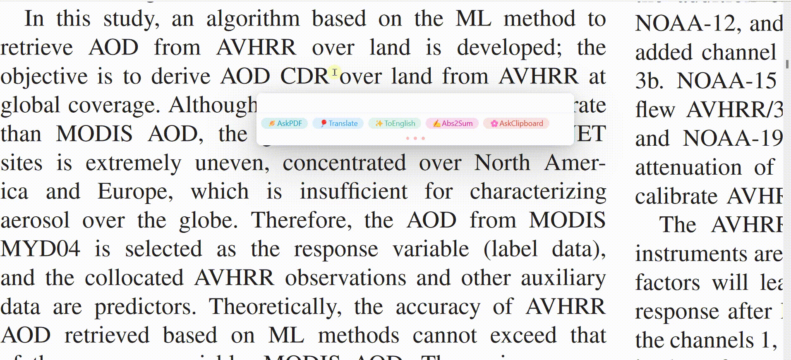
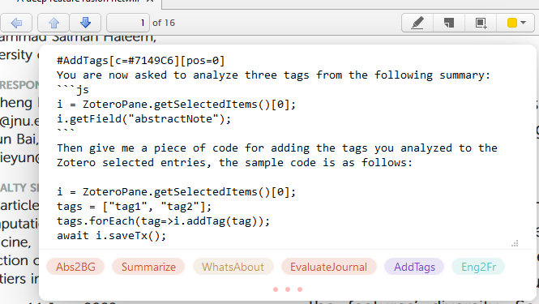
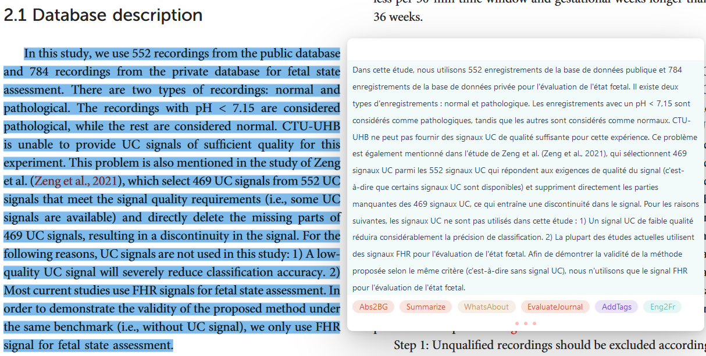

  

# Zotero GPT

[中文文档](https://www.yuque.com/polygon-qvorl/hcf5p8/zxoogs59anx1drqw/edit)

This plugin is for users with some basic programming skills

Share the tag command you made in [here](https://github.com/MuiseDestiny/zotero-gpt/discussions/3)

  

---

[视频演示](https://b23.tv/4mNydhl)

## Quick Start

Use `Shift + /` to call this plug-in，select the text in a PDF file and then press`Shift + Tab + /` to enter the prompt input. Use `Esc` to exit.

API-key：

## Command Tags

The plug-in design concept is to configure command tabs according to different application scenarios, and directly click on the tabs to complete the interaction with GPT.

Type `#label_name[color=#eee][position=1]` and Enter to edit a lable. Save with `Ctrl + S`. Save and Run with `Ctrl + R`.

`color` can be abbreviated to `c`, `position` can be reviated to `pos` and the values can be quoted.

For example, `#test[c=#eee][pos=9]` is a legit input.

Of course `color` and `position` are optional parameters and will have default values if not entered.

In the next step, you can declare an executable code fragment for the current environment like this:

It will be executed and the returned result will replace the code snippet here.

You can command GPT to output a code fragment and the plugin can execute it.

Click the left mouse button and hold to enter the edit mode of a label.

**Hold with the right mouse button is to delete the label**.

Single click on a label is to execute it.

You can click and hold on each label after installing the plugin to see the internal statements of the sample tags, and I'm sure you'll be up and running writing a new one in no time.

## Ask PDF [build-in tag]

Implementation method:

Make sure the plugin version is up-to-date.

## Search Items [build-in tag]

Implementation method: 
Same as `Ask PDF`

## Demonstration

## Support the project

[Here](https://github.com/MuiseDestiny/zotero-reference#%E8%B5%9E%E5%8A%A9)

